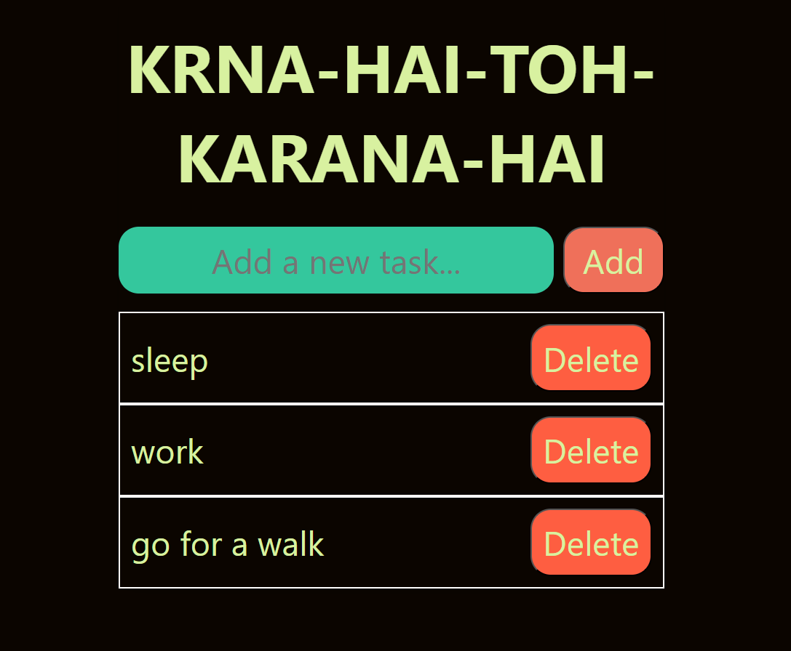

# ✅ Simple To-Do App

This is a basic **To-Do List App** built using HTML, CSS, and JavaScript.  
It allows users to:

- ➕ Add new tasks  
- ❌ Delete existing tasks

A great starting point for learning DOM manipulation and event handling in JavaScript!

---

## 📸 Demo

 

---

## 🛠️ Technologies Used

- HTML5
- CSS3
- JavaScript (Vanilla)

---

## 🚀 Features

- Add a task to the list
- Remove individual tasks
- Minimal, clean user interface
- Fully client-side — no backend needed

---

## 📂 How to Use

1. Clone the repository:

   ```bash
   git clone https://github.com/UDAYhere/TO-DO.git
